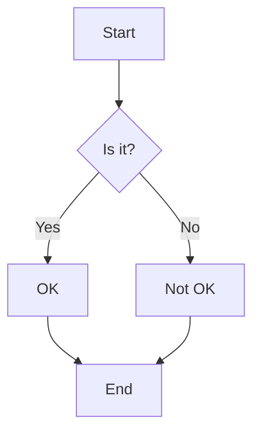
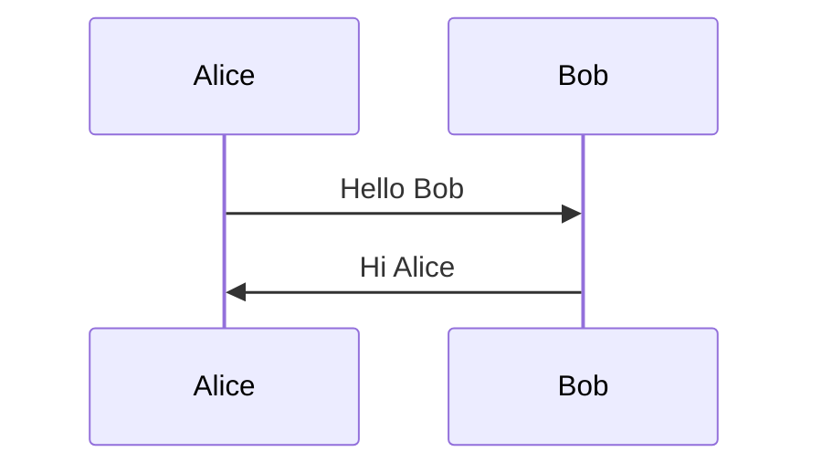
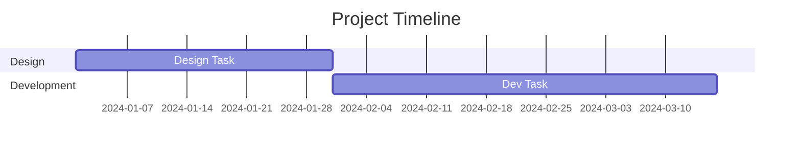
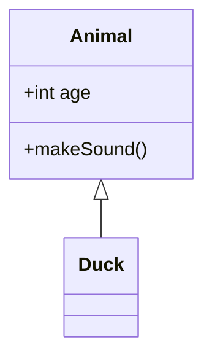
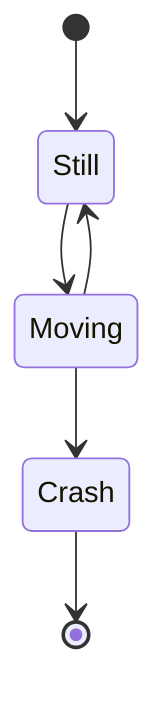
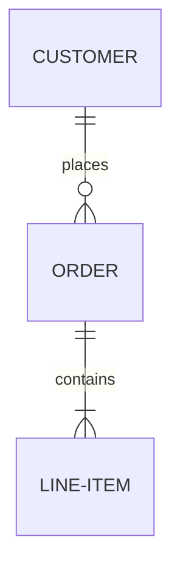
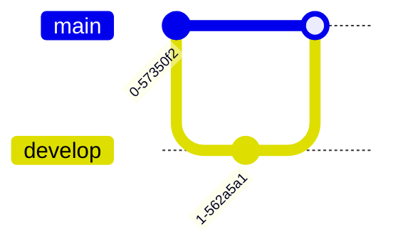
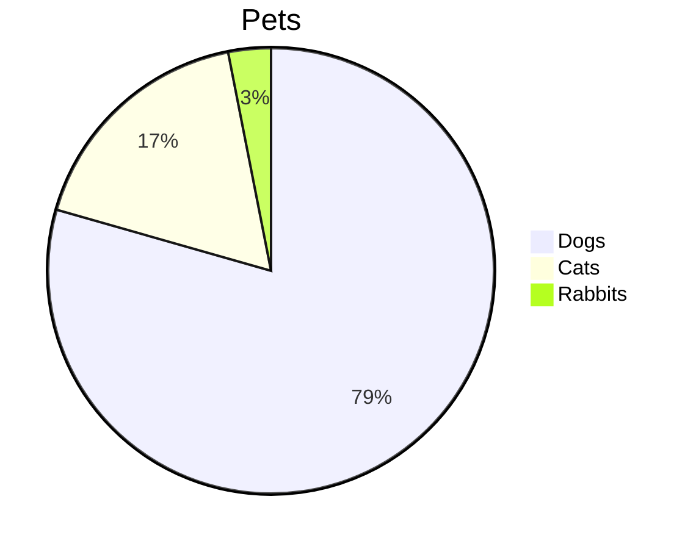
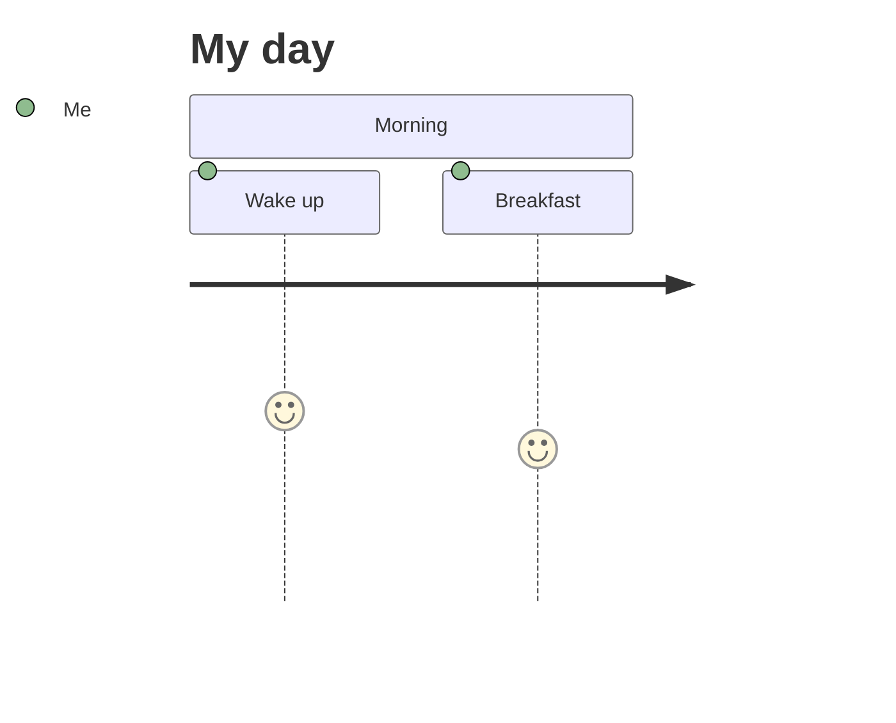
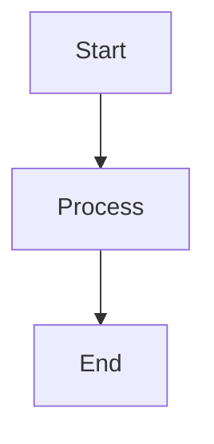

# ✅ Mermaid Diagram Support Implementation Complete!

## Overview

Successfully added Mermaid diagram rendering to your copilot slideout. The AI can now display beautiful visual diagrams including flowcharts, sequence diagrams, Gantt charts, class diagrams, and more directly in chat messages.

---

## 🎯 What Was Implemented

### 1. Mermaid Diagram Component Installed

**Command Used:**
```bash
npx shadcn@latest add @assistant-ui/mermaid-diagram
```

**Created File:**
- `src/components/mermaid-diagram.tsx` - Complete Mermaid rendering component

**Dependencies Installed:**
- `mermaid` npm package - Powerful diagramming library

### 2. Markdown Text Component Updated

**File Modified:**
`src/components/markdown-text.tsx`

**Changes Made:**

1. **Added Import:**
```typescript
import { MermaidDiagram } from "@/components/mermaid-diagram";
```

2. **Added componentsByLanguage Configuration:**
```typescript
const MarkdownTextImpl = () => {
  return (
    <MarkdownTextPrimitive
      remarkPlugins={[remarkGfm]}
      className="aui-md"
      components={defaultComponents}
      componentsByLanguage={{
        mermaid: {
          SyntaxHighlighter: MermaidDiagram,
        },
      }}
    />
  );
};
```

This tells the markdown renderer to use `MermaidDiagram` component when it encounters code blocks with the `mermaid` language tag.

---

## 🎨 Features

### Smart Streaming Support
- **Completion Detection**: Only renders when code block is complete
- **Zero Failed Renders**: Avoids parsing incomplete diagram code during streaming
- **Real-time Updates**: Smoothly handles AI responses as they stream in

### Diagram Rendering
- **SVG Output**: High-quality scalable vector graphics
- **Interactive**: Diagrams can be interactive (if configured)
- **Responsive**: Automatically fits within container
- **Styled**: Matches your app's theme

### Performance
- **Optimized**: Uses `useMessagePart` to detect completion
- **Error Handling**: Gracefully handles invalid diagram syntax
- **Async Rendering**: Non-blocking diagram generation

---

## 📊 Supported Diagram Types

### Flowcharts & Decision Trees


### Sequence Diagrams


### Gantt Charts


### Class Diagrams (UML)


### State Diagrams


### Entity Relationship Diagrams (ERD)


### Git Graphs


### Pie Charts


### User Journey Maps


### And More!
- Quadrant charts
- Mindmaps
- Timeline diagrams
- Requirement diagrams

---

## 📁 Files Changed

### Created
1. `src/components/mermaid-diagram.tsx` (95 lines)
   - Smart completion detection
   - Async rendering with error handling
   - Theme configuration

### Modified
1. `src/components/markdown-text.tsx`
   - Added MermaidDiagram import
   - Added componentsByLanguage configuration

---

## ⚙️ Configuration

### Theme Customization

Edit `src/components/mermaid-diagram.tsx` line 17:

```typescript
// Current configuration
mermaid.initialize({ theme: "default", startOnLoad: false });
```

**Available Themes:**
- `"default"` - Standard theme (current)
- `"dark"` - Dark theme
- `"neutral"` - Neutral gray theme
- `"forest"` - Green forest theme
- `"base"` - Minimal base theme

**Additional Options:**
```typescript
mermaid.initialize({
  theme: "default",
  startOnLoad: false,
  themeVariables: {
    primaryColor: "#your-color",
    primaryTextColor: "#fff",
    primaryBorderColor: "#your-border-color",
  },
  flowchart: {
    useMaxWidth: true,
    htmlLabels: true,
  },
});
```

### Dark Mode Support

To automatically switch theme based on dark mode:

```typescript
import { useTheme } from "next-themes";

// Inside component
const { theme } = useTheme();
mermaid.initialize({ 
  theme: theme === "dark" ? "dark" : "default",
  startOnLoad: false 
});
```

---

## 🚀 Testing

### How to Test

1. **Start Dev Server:**
```bash
npm run dev
```

2. **Open Copilot Slideout:**
   - Click the floating ⭐ button

3. **Ask AI to Create Diagrams:**
   Try these prompts:

**Flowchart:**
```
Create a flowchart showing the user login process with authentication steps
```

**Sequence Diagram:**
```
Show me a sequence diagram for a REST API authentication flow
```

**Gantt Chart:**
```
Generate a Gantt chart for a 3-month software development project
```

**Class Diagram:**
```
Create a class diagram for a blog system with User, Post, and Comment classes
```

**State Diagram:**
```
Show me a state diagram for an order processing system
```

### What to Verify

- ✅ Diagrams render correctly
- ✅ Diagrams appear after AI finishes code block
- ✅ No errors during streaming
- ✅ Diagrams are styled appropriately
- ✅ "Drawing diagram..." appears before render
- ✅ Diagrams are centered and responsive
- ✅ Dark mode matches (if configured)
- ✅ Complex diagrams render without errors

### Example Test Prompts

**Simple Flowchart:**
```
Can you create a simple flowchart showing how to make coffee?
```

**Authentication Flow:**
```
Create a sequence diagram showing OAuth 2.0 authentication flow between client, auth server, and resource server
```

**Project Timeline:**
```
Generate a Gantt chart for building a web application with phases: Design (2 weeks), Development (6 weeks), Testing (2 weeks), Deployment (1 week)
```

**Database Schema:**
```
Show me an ER diagram for an e-commerce database with users, products, orders, and order items
```

---

## 💡 How It Works

### 1. AI Response
When the AI responds with a mermaid diagram, it uses markdown code blocks:

````markdown

````

### 2. Markdown Parser
The `MarkdownTextPrimitive` component detects the `mermaid` language tag.

### 3. Component Mapping
Based on `componentsByLanguage` configuration, it uses `MermaidDiagram` component.

### 4. Smart Rendering
`MermaidDiagram` component:
- Detects when the code block is complete
- Calls `mermaid.render()` to generate SVG
- Injects the SVG into the DOM
- Shows "Drawing diagram..." while rendering

### 5. Display
The rendered SVG diagram appears in the chat message.

---

## 🎓 For AI Prompt Engineering

### Best Practices for Requesting Diagrams

**Be Specific:**
```
✅ Create a flowchart showing the user registration process with email verification
❌ Make a diagram
```

**Specify Diagram Type:**
```
✅ Generate a sequence diagram for...
✅ Show me a Gantt chart of...
✅ Create a class diagram for...
```

**Provide Context:**
```
✅ Create a state diagram for an order processing system with states: Pending, Processing, Shipped, Delivered, Cancelled
❌ Show states
```

**Request Specific Elements:**
```
✅ Create a flowchart with decision points for age verification and payment processing
```

---

## ⚠️ Limitations & Notes

### Current Limitations
- Diagrams render after code block is complete (not during streaming)
- Invalid syntax shows "Drawing diagram..." with console warning
- Very complex diagrams may take longer to render
- Theme is static (doesn't auto-switch with dark mode unless configured)

### Performance Considerations
- Large diagrams (50+ nodes) may impact performance
- Consider setting diagram size limits in production
- Mermaid rendering is client-side only

### Browser Compatibility
- Works in all modern browsers
- SVG support required (all modern browsers have it)
- May have limitations in very old browsers

---

## 🔧 Advanced Configuration

### Custom Styling

Add custom styles to `mermaid-diagram.tsx`:

```typescript
<pre
  ref={ref}
  className={cn(
    "aui-mermaid-diagram rounded-b-lg bg-muted p-4 text-center [&_svg]:mx-auto [&_svg]:max-w-full",
    className,
  )}
>
```

### Size Constraints

Limit diagram size:

```typescript
mermaid.initialize({
  theme: "default",
  startOnLoad: false,
  flowchart: {
    useMaxWidth: true,
  },
  maxWidth: 800, // Max width in pixels
});
```

### Interactive Features

Enable interactivity:

```typescript
mermaid.initialize({
  theme: "default",
  startOnLoad: false,
  securityLevel: "loose", // Allows click events
});
```

---

## 📚 Documentation References

- [assistant-ui Mermaid Documentation](https://www.assistant-ui.com/docs/ui/mermaid-diagrams)
- [Mermaid Official Documentation](https://mermaid.js.org/)
- [Mermaid Live Editor](https://mermaid.live/) - Test diagrams online
- [Mermaid Syntax Reference](https://mermaid.js.org/intro/syntax-reference.html)

---

## ✅ Summary

### What's Working Now
- ✅ Mermaid diagram rendering in chat messages
- ✅ 10+ diagram types supported
- ✅ Smart streaming detection (no failed renders)
- ✅ Automatic SVG generation
- ✅ Error handling for invalid syntax
- ✅ Responsive and centered diagrams
- ✅ Styled to match your theme
- ✅ Zero linter errors

### What Users Can Do
- 📊 Ask AI to create flowcharts
- 🔄 Request sequence diagrams
- 📅 Generate Gantt charts
- 🏗️ Get class diagrams
- 🗺️ View user journey maps
- 📈 See state diagrams
- 🌳 Display git graphs
- 🔗 Create ER diagrams
- And much more!

---

## 🎉 Ready to Use!

Your copilot now has powerful visual diagram capabilities! Users can ask the AI to create diagrams and see them rendered beautifully in real-time.

**Try it now:**
1. `npm run dev`
2. Open copilot slideout
3. Ask: "Create a flowchart showing how HTTP requests work"
4. Watch the diagram appear! 📊✨

**Your copilot now features:**
- ✅ AI chat with streaming responses
- ✅ File attachments with previews
- ✅ **NEW:** Mermaid diagram rendering
- ✅ Markdown formatting
- ✅ Code syntax highlighting
- ✅ Message actions (copy, retry)
- ✅ Dark mode support
- ✅ Mobile responsive

**Enjoy creating visual diagrams with AI! 🎨📊**

